**Remarque** : cette activité est inspirée de Travaux Pratiques présents dans le cours CISCO IT Essentials.

## Sauvegarde et restauration de données

Windows 7 dispose en standard d'un outil de sauvegarde de données. Voici sa description par Microsoft.

> "La Sauvegarde Windows vous permet d’effectuer des copies de fichiers de données destinés à tous les utilisateurs de l’ordinateur. Vous pouvez laisser Windows choisir le contenu à sauvegarder ou vous pouvez sélectionner les dossiers, bibliothèques et lecteurs individuels à sauvegarder. Par défaut, vos sauvegardes sont créées en fonction d’un planning régulier. Vous pouvez modifier le planning et créer manuellement une sauvegarde à tout moment. Une fois que vous avez configuré la Sauvegarde Windows, Windows effectue un suivi des fichiers et dossiers qui sont nouveaux ou modifiés et les ajoutent à votre sauvegarde." 

Nous allons le mettre en oeuvre pour sauvegarder le contenu du Bureau Windows.

###Etape 1.1 : préparation de la machine

* Ouvrez une session en tant qu’Administrateur.
 Créez un fichier texte sur le Bureau et appelez-le **Fichier1**. Ouvrez le fichier et tapez le texte suivant : "Non modifié".


* Créez un autre fichier texte sur le Bureau et appelez-le **Fichier2**. Ouvrez le fichier et tapez le texte suivant : "Modifié".

* Supprimez tous les dossiers et fichiers inutiles sur le Bureau. Cela permettra de réduire la durée de la sauvegarde au cours de ce TP.

### Etape 1.2 : création de la sauvegarde

* Cliquez sur **Démarrer > Tous les programmes > Maintenance > Sauvegarder et restaurer**. L’écran "Sauvegarder ou restaurer des fichiers » s’affiche.

{:.centered}

* Cliquez sur **Configurer la sauvegarde**. 

* Branchez sur votre machine un support externe amovible, de type clé USB ou disque dur externe.

* Cliquez sur **Actualiser** pour faire apparaître le nouveau périphérique dans la liste. Sélectionnez-le.

{:.centered}

* Cliquez sur **Suivant**. L’écran "Que voulez-vous sauvegarder ? » s’affiche.

{:.centered}

* Sélectionnez **Me laisser choisir**. Cliquez sur **Suivant**.

* Développez le compte d’utilisateur actuel et les emplacements supplémentaires afin que vous puissiez voir les différents emplacements.

Quelles bibliothèques peuvent être sauvegardées ?

Quels fichiers sont exclus par défaut de la sauvegarde ?

* Développez **Emplacements supplémentaires** et sélectionnez uniquement **Bureau**. 

{:.centered}

* Cliquez sur *Suivant*. L’écran "Vérifiez vos paramètres de sauvegarde » s’affiche.

* Cliquez sur Modifier la planification. L’écran "Quelle est la fréquence de sauvegarde souhaitée ? » s’affiche.

Quelles sont les options de fréquence possibles pour une sauvegarde ?

* Définissez les conditions suivantes : 

    * Fréquence : Tous les jours

    * Quel jour : vide

    * Quelle heure : 2:00

* Cliquez sur OK.
 L’écran "Vérifiez vos paramètres de sauvegarde » s’affiche.

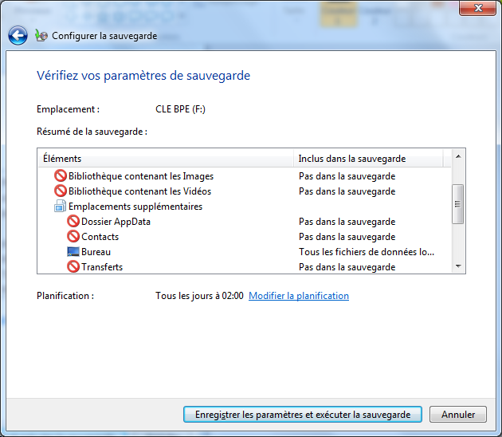
{:.centered}

* Cliquez sur Enregistrer les paramètres et exécuter la sauvegarde. La fenêtre "Sauvegarder et restaurer » s’affiche et la sauvegarde démarre.

{:.centered}

* Cliquez sur Afficher les détails. L’écran "La sauvegarde Windows est en cours » s’affiche.

* Attendez la fin de la sauvegarde. L’écran "La sauvegarde Windows s’est effectuée correctement » s’affiche ensuite.

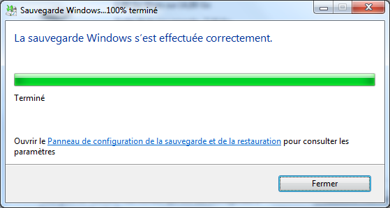
{:.centered}

Sous quelle forme la sauvegarde apparaît-elle sur le support externe ?

### Etape 1.3 : Restauration des données

* Accédez au Bureau, supprimez le fichier Fichier1 et ajoutez au fichier Fichier2 la ligne "Contenu ajouté". Videz la Corbeille.

* Dans la fenêtre **Sauvegarder et restaurer**, cliquez sur **Choisir une autre sauvegarde comme source de restauration**.
 L’écran "Sélectionner la sauvegarde à partir de laquelle vous voulez restaurer des fichiers" s’affiche.

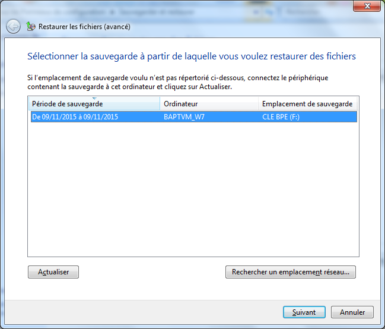
{:.centered}

* Sélectionnez l'emplacement où votre sauvegarde a été effectuée, puis cliquez sur **Suivant**. L’écran "Rechercher dans la sauvegarde des fichiers ou dossiers à restaurer" s’affiche.

{:.centered}

* Cliquez sur **Fichiers**. La fenêtre "Rechercher des fichiers dans la sauvegarde" s’affiche. Cliquez sur la sauvegarde de l’utilisateur actuel (Exemple : "Sauvegarde de Baptiste"). Double-cliquez sur **Desktop** et localisez les fichiers du bureau sauvegardés.

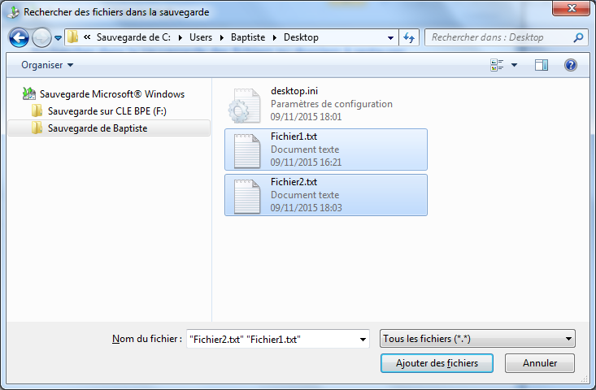
{:.centered}

** Sélectionnez ces fichiers puis cliquez sur **Ajouter des fichiers**. Les deux fichiers doivent apparaître dans l’&cran "Rechercher dans la sauvegarde des fichiers ou dossiers à restaurer".

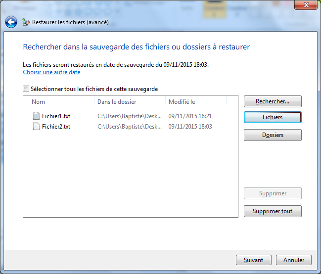
{:.centered}

* Cliquez sur **Suivant**. L’écran "Où voulez-vous restaurer vos fichiers ?" s’affiche.Sélectionnez **Dans l’emplacement d’origine**, puis cliquez sur **Restaurer**.

* Une boîte de dialogue apparaît. Sélectionnez **Copier et remplacer**.

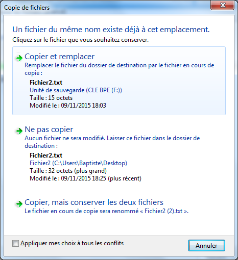
{:.centered}

* A la fin de la restauration, cliquez sur **Terminer**.

Quel est maintenant le contenu du fichier **Fichier1** ? Pourquoi ?

Quel est maintenant le contenu du fichier **Fichier2** ? Pourquoi ?

* Supprimez les fichiers **Fichier1** et **Fichier2** du Bureau Windows. Videz la Corbeille.

### Conclusion

Quel est l'intérêt de sauvegarder régulièrement ses fichiers personnels ?

Selon vous, vaut-il mieux opter pour une sauvegarde planifiée ou la lancer manuellement à intervalles réguliers ?

## Sauvegarde et restauration du système

Outre les données, Windows 7 permet également de protéger le système et les applications installées. Cette fonctionnalité est décrite ainsi par Microsoft :

> "La Restauration du système vous aide à restaurer les fichiers système de votre ordinateur à un point antérieur dans le temps. Cela permet d’annuler les modifications du système sans affecter vos fichiers personnels, tels que les messages électroniques, les documents ou les photos. La Restauration du système utilise une fonctionnalité nommée Protection du système pour une création et un enregistrement réguliers des points de restauration sur votre ordinateur. Ces points de restauration contiennent des informations sur les paramètres du Registre, ainsi que d’autres informations système utilisées par Windows. Vous pouvez également créer des points de restauration manuellement."

* Cliquez sur **Démarrer** et cliquez avec le bouton droit sur **Ordinateur > Propriétés**. La fenêtre "Système" s’affiche.

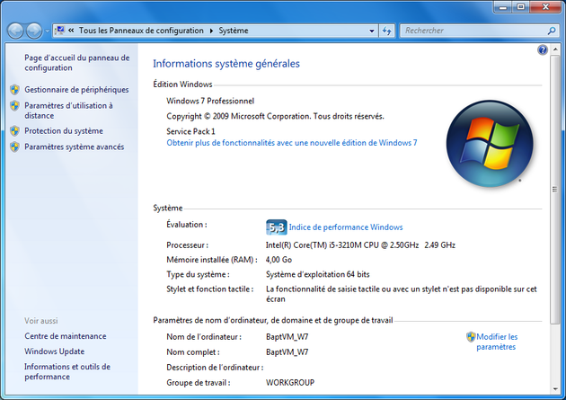
{:.centered}

* Pour créer un point de restauration, cliquez sur **Protection du système**. La fenêtre "Propriétés système" s’affiche. Dans l’onglet "Protection du système", cliquez sur **Créer**.

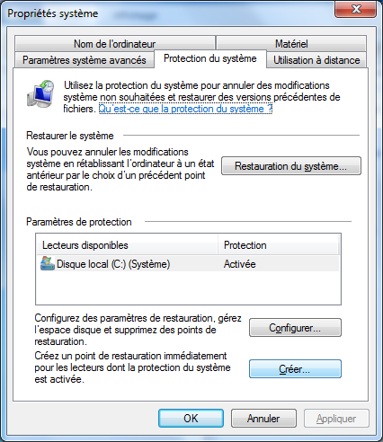
{:.centered}

* Dans le champ de description "Créer un point de restauration", tapez "Avant installation Paint.NET". Cliquez sur **Créer**.

{:.centered}

* 4Au bout de quelques instants, le message "Le point de restauration a été créé" apparaît. Cliquez sur **Fermer**. Cliquez sur **OK** pour fermer la fenêtre "Propriétés système".

* Cliquez sur **Démarrer > Tous les programmes > Accessoires > Outils système > Restauration du
système**. 
Lorsque la fenêtre "Restauration du système" s’affiche, cliquez sur **Suivant**. Une liste des points de restauration s’affiche. Elle contient notamment le dernier point créé.

{:.centered}

Quel est le type du point de restauration que vous avez créé ?

* Cliquez sur **Annuler** pour annuler la restauration.

* Lancez l'installation du logiciel [Paint.NET](http://www.getpaint.net). Suivez la procédure d'installation en acceptant la licence et en choisissant les options par défaut. Terminez sans lancer Paint.NET.

   * L'installation de **paint.net** nécessite la présence du framework .NET sur la machine, et lance son téléchargement sinon. Si le téléchargement prend trop de temps, annulez l'installation de **paint.net** et installez Mozilla Thunderbird à la place.

* Dans le menu **Démarrer**, trouvez et lancez **paint.net** pour vérifier son installation. Fermez ensuite le programme.

{:.centered}

* Cliquez sur **Démarrer > Tous les programmes > Accessoires > Outils système > Restauration du système**. La liste des points de restauration s'affiche.

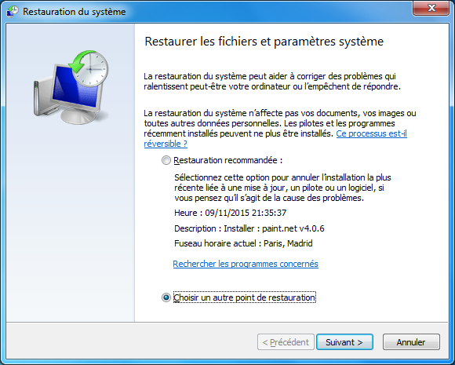
{:.centered}

D'où provient le dernier point de restauration ? Quel est son type ?

* Sélectionnez "Choisir un autre point de restauration", puis cliquez sur **Suivant**.

* Sélectionnez le point de restauration "Avant installation Paint.NET" dans la liste. Cliquez sur **Suivant**.

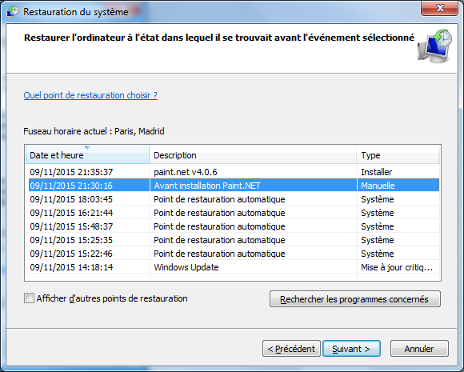
{:.centered}

* Cliquez sur **Terminer** puis confirmez pour lancer la restauration du système au point choisi. Le système est ramené à son état antérieur, puis redémarre. Cette opération dure plusieurs minutes.

* Rouvrez si besoin une session sur l'ordinateur.

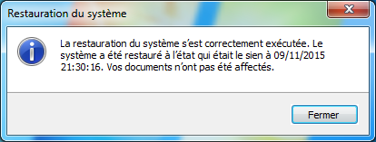
{:.centered}

Le programme Paint.NET est-il présent dans le menu Démarrer ? Pourquoi ?

D'où provient le dernier point de restauration ? Quel est son type ?

### Conclusion

Expliquez l'intérêt de la fonctionnalité de restauration du système de Windows.
