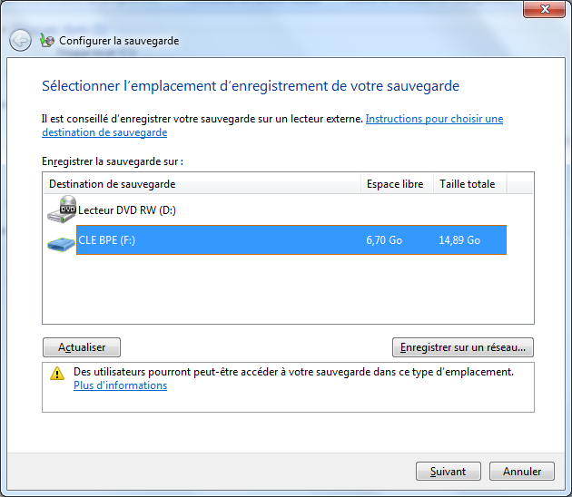
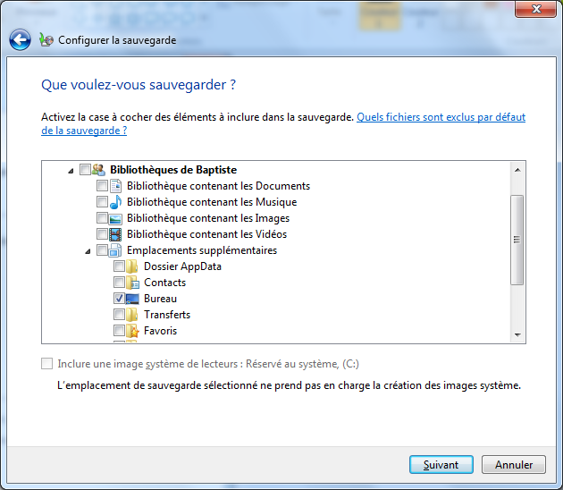
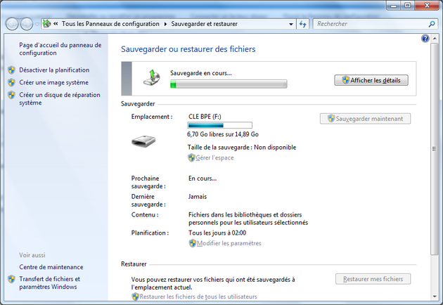

## Sauvegarde et restauration de données

Windows 7 dispose en standard d'un outil de sauvegarde. Nous allons le mettre en oeuvre pour sauvegarder le contenu du Bureau Windows.

###Etape 1.1 : préparation de la machine

* Ouvrez une session en tant qu’Administrateur.
 Créez un fichier texte sur le Bureau et appelez-le **Fichier1**. Ouvrez le fichier et tapez le texte suivant : "Non modifié".


* Créez un autre fichier texte sur le Bureau et appelez-le **Fichier2**. Ouvrez le fichier et tapez le texte suivant : "Modifié".

* Supprimez tous les dossiers et fichiers inutiles sur le Bureau. Cela permettra de réduire la durée de la sauvegarde au cours de ce TP.

### Etape 1.2 : création de la sauvegarde

* Cliquez sur **Démarrer > Tous les programmes > Maintenance > Sauvegarder et restaurer**. L’écran « Sauvegarder ou restaurer des fichiers » s’affiche.

{:.centered}

* Cliquez sur **Configurer la sauvegarde**. 

* Branchez sur votre machine un support externe amovible, de type clé USB ou disque dur externe.

* Cliquez sur **Actualiser** pour faire apparaître le nouveau périphérique dans la liste. Sélectionnez-le.

{:.centered}

* Cliquez sur **Suivant**. L’écran « Que voulez-vous sauvegarder ? » s’affiche.

{:.centered}

* Sélectionnez **Me laisser choisir**. Cliquez sur **Suivant**.

* Développez le compte d’utilisateur actuel et les emplacements supplémentaires afin que vous puissiez voir les différents emplacements.

Quelles bibliothèques peuvent être sauvegardées ?

Quels fichiers sont exclus par défaut de la sauvegarde ?

* Développez **Emplacements supplémentaires** et sélectionnez uniquement **Bureau**. 

{:.centered}

* Cliquez sur *Suivant*. L’écran « Vérifiez vos paramètres de sauvegarde » s’affiche.

* Cliquez sur Modifier la planification. L’écran « Quelle est la fréquence de sauvegarde souhaitée ? » s’affiche.

Quelles sont les options de fréquence possibles pour une sauvegarde ?

* Définissez les conditions suivantes : 

    * Fréquence : Tous les jours

    * Quel jour : vide

    * Quelle heure : 2:00

* Cliquez sur OK.
 L’écran « Vérifiez vos paramètres de sauvegarde » s’affiche.

{:.centered}

* Cliquez sur Enregistrer les paramètres et exécuter la sauvegarde. La fenêtre « Sauvegarder et restaurer » s’affiche et la sauvegarde démarre.

{:.centered}

* Cliquez sur Afficher les détails. L’écran « La sauvegarde Windows est en cours » s’affiche.

* Attendez la fin de la sauvegarde. L’écran « La sauvegarde Windows s’est effectuée correctement » s’affiche ensuite.

{:.centered}

Sous quelle forme la sauvegarde apparaît-elle sur le support externe ?

### Etape 1.3 : Restauration des données

* Accédez au Bureau, supprimez les deux fichiers Fichier1.txt et Fichier2.txt. Videz la Corbeille.

